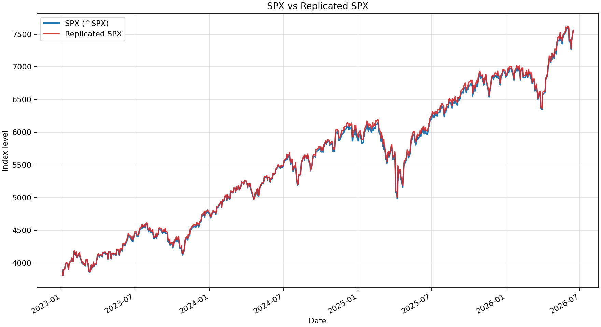

# open-spx

Open Python tooling for approximate bottom-up replication and contribution analysis of S&P 500 price-index returns from user-provided CSV inputs.

## Motivation

This project started from a simple question raised by recent finance discussions about S&P 500 concentration: if an increasing share of index returns is contributed by a smaller share of constituents, where can you inspect those return contributions directly? Which names are actually carrying the index, and how does that change through time?

After looking for public tooling around this question, I did not find a clean source that exposed point-in-time S&P 500 return contributions. That gap exists because S&P 500 contribution analysis is not just a stock-return problem. It is an index-contribution problem. A stock's contribution depends on its return, its point-in-time index membership, and its point-in-time index weight. The S&P U.S. index methodology describes the indices as float-adjusted market-cap weighted, with index levels maintained through divisor mechanics around constituent and corporate-action changes ([S&P Dow Jones Indices methodology](https://www.spglobal.com/spdji/en/methodology/article/sp-us-indices-methodology/)). Official index weights are not publicly available as a complete point-in-time history, and exact float adjustments, divisor changes, and corporate-action treatments are not fully observable from free public data.

That creates several practical problems for anyone trying to explain S&P 500 performance from the bottom up:

| Topic                                 | Challenge                                                                                                                                                                                                               | What `open-spx` does                                                                                                                                     | What it does not resolve                                                                                 |
| ------------------------------------- | ----------------------------------------------------------------------------------------------------------------------------------------------------------------------------------------------------------------------- | -------------------------------------------------------------------------------------------------------------------------------------------------------- | -------------------------------------------------------------------------------------------------------- |
| Daily constituent history             | The index changes through additions, deletions, mergers, spin-offs, ticker changes, and share-class events. A static current ticker list cannot explain a historical period cleanly.                                    | Builds a point-in-time membership matrix from historical constituent snapshots and optional ticker mappings.                                             | Does not certify that every index event is represented exactly as implemented by the official index.     |
| Price-index returns                   | The S&P 500 price index excludes ordinary dividends, so price-index and total-return inputs should not be mixed casually.                                                                                               | Computes constituent returns from close-price CSV inputs and compares them with a supplied S&P 500 price-index series.                                   | Does not model total-return index contribution or dividend reinvestment effects.                         |
| Corporate actions and index mechanics | Splits, special dividends, spin-offs, mergers, index additions/deletions, float changes, and divisor adjustments can all affect official index contribution in ways that simple `weight * return` cannot fully capture. | Makes the approximation explicit, produces prior and fitted contribution files, and surfaces diagnostic gaps between prior exposure and fitted exposure. | Does not reproduce official divisor mechanics, investable weight factors, or corporate-action treatment. |
| Underidentified weights               | One daily index return cannot uniquely identify hundreds of constituent weights.                                                                                                                                        | Fits a regularized, prior-constrained RNN weight path as one smooth explanation of the supplied return series.                                           | Does not recover official constituent weights or prove that fitted weights match official S&P weights.   |

`open-spx` addresses part of this gap by making the approximation explicit and reproducible. It builds a point-in-time membership matrix from historical constituent snapshots, estimates time-varying prior weights from user-provided market-cap or shares-outstanding CSV inputs, computes daily return contributions, compares the replication against a user-provided S&P 500 price-index series, and optionally fits a constrained masked RNN adjustment layer against that index return series. The RNN design, training objective, timing convention, and interpretation caveats are documented in [RNN Weight Inference Methodology](docs/rnn_methodology.md).

The inferred weights are not official S&P Dow Jones Indices weights. They are model-implied effective replication weights fitted from the supplied inputs. Because each day provides one aggregate index return but hundreds of constituent weights, fitted weights are not uniquely identified. Treat them as diagnostics and approximations, not recovered official index data.

## What This Does Not Do

`open-spx` does not reproduce the official S&P 500 methodology, official float-adjusted shares, investable weight factors, index divisor, dividends, or all corporate-action treatment. It does not recover official constituent weights. The RNN layer is a fitted, prior-constrained explanation of the observed return series, not an independent source of index data.

Final RNN tracking error is in-sample unless the user implements a holdout or walk-forward split. It should be compared with the prior-weight replication error, but it should not be read as independent evidence that the fitted weights match official S&P weights.

## Example Output

The README includes an example output set for date range 2023-1-1 through 2026-6-15. It is intended as a compact fixture for inspecting the shape of the generated CSV files and plot artifacts. The RNN metrics below are in-sample for this example and should be read as illustration, not independent validation of official S&P 500 weights. Prefer `replication_metrics_by_model.csv` when comparing the prior replication with the fitted layer.



Example tracking metrics from `data/replication_metrics.csv`:

| Metric                    |   Value |
| ------------------------- | ------: |
| Mean tracking diff daily  | 0.0003% |
| Tracking error daily      | 0.1211% |
| Tracking error annualized | 1.9221% |
| Observations              |     864 |

Latest rows from `data/replication_vs_sp500.csv`:

| Date       |     SPX | Replicated SPX | Tracking diff |
| ---------- | ------: | -------------: | ------------: |
| 2026-06-09 | 7386.65 |        7399.13 |      -0.0234% |
| 2026-06-10 | 7266.99 |        7279.84 |       0.0077% |
| 2026-06-11 | 7394.30 |        7402.68 |      -0.0645% |
| 2026-06-12 | 7431.46 |        7438.84 |      -0.0141% |
| 2026-06-15 | 7554.29 |        7562.45 |       0.0088% |

Largest compounded positive contributors from `data/return_contributions.csv`:

| Ticker | Compounded contribution |
| ------ | ----------------------: |
| NVDA   |                11.2391% |
| AAPL   |                 5.8250% |
| AMZN   |                 4.3439% |
| MSFT   |                 3.9052% |
| AVGO   |                 3.4852% |
| GOOGL  |                 3.3438% |
| GOOG   |                 3.1062% |
| META   |                 2.8460% |

Largest compounded negative contributors from `data/return_contributions.csv`:

| Ticker | Compounded contribution |
| ------ | ----------------------: |
| PFE    |                -0.3948% |
| MMC    |                -0.3380% |
| UNH    |                -0.2290% |
| NKE    |                -0.1754% |
| MRNA   |                -0.1276% |
| UPS    |                -0.1112% |
| BMY    |                -0.1110% |
| EL     |                -0.1047% |

`data/largest_market_cap_difference_case.png` provides a second diagnostic plot for the ticker with the largest average market-cap-equivalent gap between the fitted exposure and prior.

The same example run also includes a synthetic exclusion scenario in `data/synthetic/synthetic_ex_mag_7/`, created by excluding `GOOG`, `GOOGL`, `AMZN`, `AAPL`, `META`, `MSFT`, `NVDA`, and `TSLA` from the fitted weights and rebalancing the remaining names.

Synthetic tracking metrics from `data/synthetic_ex_mag_7/replication_metrics.csv`:

| Metric                    |    Value |
| ------------------------- | -------: |
| Mean tracking diff daily  | -0.0231% |
| Tracking error daily      |  0.3892% |
| Tracking error annualized |  6.1776% |
| Observations              |      864 |

Latest rows from `data/synthetic_ex_mag_7/synthetic_index.csv`:

| Date       | Synthetic Index | Synthetic return |
| ---------- | --------------: | ---------------: |
| 2026-06-09 |         6068.70 |          0.2202% |
| 2026-06-10 |         5986.66 |         -1.3518% |
| 2026-06-11 |         6104.46 |          1.9676% |
| 2026-06-12 |         6154.85 |          0.8255% |
| 2026-06-15 |         6226.12 |          1.1579% |

Largest compounded positive contributors in the synthetic exclusion scenario:

| Ticker | Compounded contribution |
| ------ | ----------------------: |
| AVGO   |                 5.0533% |
| MU     |                 2.9244% |
| LLY    |                 2.1508% |
| AMD    |                 2.1384% |
| WMT    |                 1.7691% |
| JPM    |                 1.5753% |
| INTC   |                 1.3052% |
| LRCX   |                 1.1603% |

## Installation

```bash
git clone https://github.com/wgeul/open-spx.git
cd open-spx
pip install -r requirements.txt
pip install -e . --no-deps
```

The provided `requirements.txt` installs the CPU-only PyTorch wheel from PyTorch's CPU wheel index. It also installs Matplotlib for CLI plots.

## Quickstart

Prepare local CSV inputs, then run:

```bash
open-spx \
  --start 2024-01-01 \
  --index data/sp500_index.csv \
  --local-data-dir data/inputs \
  --out data/run
```

Run with quieter output for logs or CI:

```bash
open-spx --start 2024-01-01 --quiet
```

You can override the two constituent input folders independently:

```bash
open-spx \
  --start 2024-01-01 \
  --index data/sp500_index.csv \
  --local-prices-dir data/prices \
  --local-market-caps-dir data/market_caps \
  --out data/run
```

You can also run a synthetic exclusion scenario after the normal replication finishes. This is useful for questions like how the index would have performed if selected recent winners were stripped out and the remaining constituents were rebalanced, but the same mechanism can be used for any fixed exclusion basket:

```bash
open-spx \
  --start 2024-01-01 \
  --index data/sp500_index.csv \
  --local-data-dir data/inputs \
  --end 2024-12-31 \
  --out data/run \
  --synthetic-exclude AAPL,MSFT,NVDA \
  --synthetic-name ex_large_winners
```

## Required CSV Inputs

### S&P 500 Index

Provide a local price-index CSV with a date column and a close/level column:

```csv
Date,Close
2024-01-02,4742.83
2024-01-03,4704.81
```

Accepted value column names include `Close`, `sp500_index`, `index`, or `level`. The CLI computes `sp500_return` from this series.

### Historical Constituents

The required constituent format is long form, with one row per date and ticker:

```csv
date,ticker
2024-01-01,A
2024-01-01,B
2024-01-02,A
2024-01-02,C
```

The default `--constituents` value points to [`fja05680/sp500`](https://github.com/fja05680/sp500), which describes itself as current and historical S&P 500 component lists since 1996 and is published under the MIT license. The upstream file is normalized internally from its snapshot format into the long format above.

The default source is a useful open dataset, not an official constituent feed. Its README notes that updates use Wikipedia and other manual checks, that Wikipedia selected changes are not complete, that symbol counts are not always exactly 500, and that the earliest years may have missing symbols. Validate event coverage and ticker mappings before relying on a period for serious analysis.

You can also pass your own local constituent CSV with `--constituents path/to/constituents.csv`.

### Constituent Prices

By default, price files are read from `data/inputs/price/TICKER.csv`. Each file should contain a `Date` column and a `Close` column. A lowercase `price` column is also accepted. If a file contains both `Close` and `Adj Close`, `Close` is used; adjusted-close series may include dividend adjustments and may not align cleanly with a price-index target.

```csv
Date,Open,High,Low,Close,Volume
2024-01-02,101.0,103.0,100.5,102.2,1234567
2024-01-03,102.2,104.1,101.7,103.6,1456789
```

Price files are filtered to each ticker's membership date range. Daily close data is strongly recommended for contribution analysis. Lower-frequency observations are accepted as dated anchors and forward-filled to daily frequency before alignment to index trading dates, but this can create artificial zero-return stretches and delayed jump returns on update days.

### Market Caps Or Shares Outstanding

By default, market-cap prior files are read from `data/inputs/market_cap/TICKER.csv`. Each file may contain either a market-cap time series or shares outstanding.

Market-cap series example:

```csv
date,market_cap
2024-01-02,12345678900
2024-01-03,12400000000
```

Shares-outstanding example:

```csv
date,shares_outstanding
2024-01-02,123456789
```

If a market-cap series is provided, it is used directly as the prior exposure scale. If only shares outstanding is provided, the CLI builds the market-cap prior as `close_price * shares_outstanding`.

## Ticker Mappings

Ticker aliases can be supplied with `--ticker-mappings`, defaulting to `data/ticker_mappings.csv` when that file exists. The mapping target is the ticker used by your local CSV files in that date range; for stale constituent snapshots this may be the S&P replacement ticker or another symbol used in your prepared CSV inputs. The file uses year-month-day date ranges:

```csv
source_ticker,target_ticker,start,end
OLD,NEW,2024-02-01,
ABC,XYZ,2024-03-04,2024-03-31
```

The `end` column is inclusive and may be blank for an open-ended mapping. Mappings are applied to the daily membership matrix, so inherited memberships from older snapshots can be mapped correctly inside the requested trading range.

By default the CLI applies a 7-calendar-day grace window to open-ended replacement mappings with `--ticker-mapping-grace-days 7`. Use `--ticker-mapping-grace-days 0` to disable this behavior.

## Synthetic Exclusion Scenarios

Pass `--synthetic-exclude` with a comma-separated fixed basket to create an additional replicated index from the regular model-implied weight output for the same `--start` / `--end` window. The base run still writes the standard S&P 500 replication files first. The synthetic pass removes the excluded tickers from each available weight timestamp, divides the remaining weights by their residual weight sum, and applies those rebalanced weights at the same daily or input-data frequency as the fitted weight matrix.

Exclusions are matched case-insensitively, and common punctuation differences such as `BRK.B` versus `BRK-B` are treated as equivalent for matching. If a requested ticker is absent from a particular date because it has not entered the index or has already exited, that date simply has no weight to remove. If a requested ticker is not found anywhere in the weight columns, the CLI emits a warning. If an exclusion basket leaves zero remaining weight on any timestamp, the run fails.

Synthetic outputs are written to `synthetic_NAME/` under `--out`, where `NAME` comes from `--synthetic-name`. The folder keeps the familiar output shapes for comparison and contribution files, plus `synthetic_index.csv` with the synthetic return and price-index series and `excluded_tickers.csv` showing which requested tickers matched the fitted weight columns. Missing prices for remaining tickers are handled exactly as in the base run.

## CLI Verbosity

The CLI prints numbered stage messages and uses `tqdm` progress bars for constituent CSV loading and RNN training. If required local files are missing or incomplete, it finishes the constituent pass, prints missing tickers grouped by input type, and exits before training. Use `--quiet` to disable progress bars and stage messages while preserving final tables and errors.

## Outputs

The CLI writes:

```text
historical_constituents.csv
membership_date_ranges.csv
prices.csv
shares_outstanding.csv
market_caps_prior_timeseries.csv
weights_prior_timeseries.csv
replication_prior_weights.csv
return_contributions_prior_weights.csv
weights_model_implied.csv
effective_exposures_model_fit.csv
market_cap_equivalent_exposure_gap.csv
returns.csv
return_contributions.csv
cumulative_top_return_contributors.csv
cumulative_top_return_bleeders.csv
replication_vs_sp500.csv
replication_metrics.csv
replication_metrics_by_model.csv
anomaly_report.csv
input_usage_report.csv
spx_vs_replicated_spx.png
largest_market_cap_difference_case.png
```

`input_usage_report.csv` summarizes rows loaded from local CSV files by stage.

`replication_vs_sp500.csv` includes `sp500_return`, `sp500_index`, `replicated_return`, `replicated_index`, and `tracking_diff`.

`replication_metrics_by_model.csv` places prior market-cap weights and RNN model-implied weights side by side. The RNN row is an ex-post in-sample fit; the prior row has no fitted layer.

`weights_model_implied.csv` contains close-of-day model-implied effective weights. The RNN is trained over the full requested window, so these weights are an ex-post smoothing solution. They should not be interpreted as weights that would have been known on the date shown. See [RNN Weight Inference Methodology](docs/rnn_methodology.md) for the full model description. `return_contributions.csv` is indexed by return date and applies the prior close's fitted weights to that day's constituent returns.

`market_caps_prior_timeseries.csv` is the market-cap prior used for weight construction. `effective_exposures_model_fit.csv` scales model-implied weights to the aggregate prior market-cap level. `market_cap_equivalent_exposure_gap.csv` compares that model-implied effective exposure with the prior and is intended as a diagnostic, not as observed free-float market capitalization.

`cumulative_top_return_contributors.csv` and `cumulative_top_return_bleeders.csv` compound daily return contributions as `(1 + contribution).cumprod() - 1`; they do not sum daily contributions.

`anomaly_report.csv` flags large single-name returns, membership transitions, and large model-vs-prior exposure gaps. These rows are starting points for data-quality review: split handling, special dividends, spin-offs, stale shares, stale market caps, ticker mappings, and other input issues can all masquerade as contribution effects.

When `--synthetic-exclude` is supplied, the CLI also writes `synthetic_NAME/` with `weights_model_implied.csv`, `returns.csv`, `return_contributions.csv`, `cumulative_top_return_contributors.csv`, `cumulative_top_return_bleeders.csv`, `replication_vs_sp500.csv`, `replication_metrics.csv`, `synthetic_index.csv`, `excluded_tickers.csv`, and `spx_vs_replicated_spx.png` for that rebalanced exclusion scenario.

## Python API

```python
from openspx import (
    DEFAULT_CONSTITUENTS_URL,
    constituent_membership_matrix,
    load_historical_constituents,
    load_member_data_for_membership,
    load_sp500_index,
    membership_date_ranges,
    replicate_index,
    replicate_with_weights,
    tracking_metrics,
    train_masked_weight_rnn,
)

start = "2024-01-01"
constituents = load_historical_constituents(DEFAULT_CONSTITUENTS_URL)
official = load_sp500_index("data/sp500_index.csv", start=start)
membership = constituent_membership_matrix(constituents, official.index)
ranges = membership_date_ranges(membership)

prices, market_caps, shares_outstanding = load_member_data_for_membership(
    ranges,
    local_data_dir="data/inputs",
)
prices = prices.reindex(index=official.index, columns=membership.columns)
market_caps = market_caps.reindex(index=official.index, columns=membership.columns)
market_caps = market_caps.where(membership, 0.0)

prior_replicated, prior_weights, returns, prior_contributions = replicate_index(
    prices=prices,
    market_caps=market_caps,
    base_index=official["sp500_index"],
)
```

## License

Code is licensed under Apache-2.0. Users are responsible for ensuring they have the rights to use and distribute the CSV inputs and generated outputs they create with this project.

This project is independent and is not affiliated with, endorsed by, or sponsored by S&P Dow Jones Indices, S&P Global, or CME Group.
