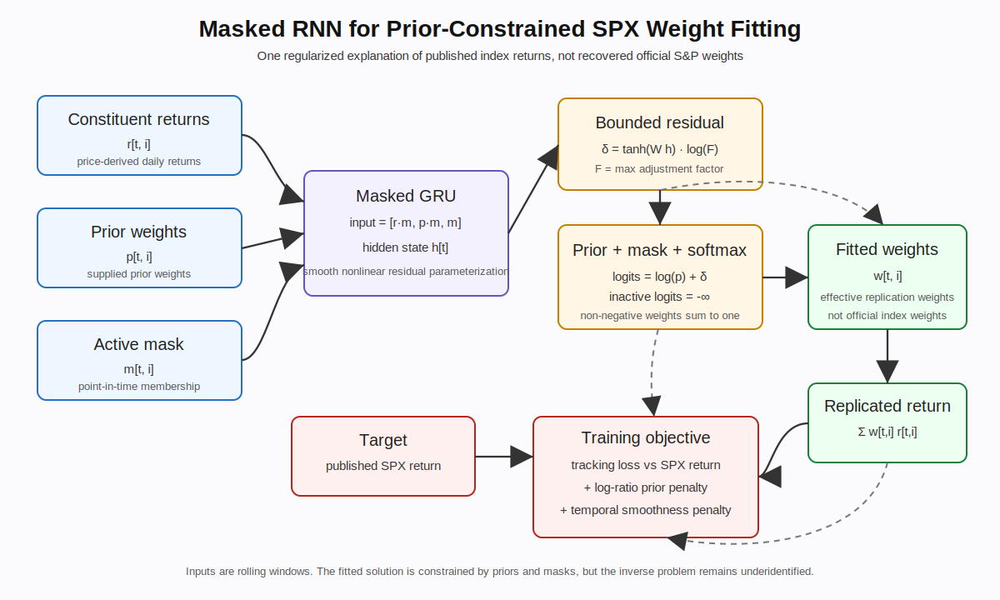

# RNN Weight Inference Methodology

This note explains the masked RNN used by `open-spx` to fit implied S&P 500 replication weights from user-provided CSV inputs.

The short version: the RNN is a constrained adjustment layer on top of user-supplied prior weights. It is not an official S&P Dow Jones Indices model, and it does not recover official index weights. It produces one regularized, prior-constrained explanation of the supplied S&P 500 price-index return series.



## Motivation

The S&P 500 is free-float market-cap weighted. Official index weights depend on float-adjusted shares, investable weight factors, corporate-action treatment, additions and deletions, and divisor mechanics. Those details are not generally observable from a simple set of price and share-count CSVs.

A transparent prior can still be built from supplied market-cap series or from supplied prices and shares outstanding:

```text
estimated_market_cap_i,t = price_i,t * shares_outstanding_i
prior_weight_i,t = estimated_market_cap_i,t / sum(estimated_market_cap_j,t for active constituents j)
```

This prior is useful, but it is not official. It can differ from official weights because total shares differ from float-adjusted index shares, because share counts may be current rather than fully historical, and because corporate actions and constituent timing can be represented differently across input files.

The RNN asks a narrower diagnostic question:

```text
Can a smooth, bounded adjustment around the supplied prior better fit the supplied SPX return series?
```

## Identification Caveat

The problem is underidentified. Each date supplies one aggregate target return:

```text
sp500_return_t
```

but the model fits hundreds of constituent weights:

```text
weight_1,t, weight_2,t, ..., weight_N,t
```

Many different weight vectors can produce nearly identical aggregate index returns. The RNN solution is one regularized solution selected by the prior, the active membership mask, bounded residual adjustments, and temporal smoothness penalties.

## Inputs

The model receives aligned close-of-day tensors:

```text
returns:       [batch, time, assets]
prior_weights: [batch, time, assets]
active_mask:   [batch, time, assets]
```

The inputs are concatenated after masking:

```text
x_t = [returns_t * active_mask_t,
       prior_weights_t * active_mask_t,
       active_mask_t]
```

The active mask prevents the model from assigning weight to companies outside their point-in-time S&P 500 membership period.

## Architecture

The architecture is intentionally modest:

```text
masked inputs -> GRU -> linear head -> bounded residual adjustment
```

The GRU consumes the sequence and produces hidden states:

```text
h_t = GRU(x_t)
```

A linear head maps hidden states to raw per-asset residuals:

```text
raw_adjustment_i,t = W h_t + b
```

Those residuals are bounded with `tanh`:

```text
delta_i,t = tanh(raw_adjustment_i,t) * log(max_adjustment_factor)
```

## Prior-Constrained Weight Construction

The model adjusts the prior in log space:

```text
logit_i,t = log(prior_weight_i,t) + delta_i,t
```

Inactive constituents are masked out, then weights are normalized with softmax:

```text
weight_i,t = softmax(logit_t)_i
```

This ensures active weights are non-negative, inactive names receive zero weight, and active weights sum to one.

## Replicated Return

Daily replicated return uses prior-close weights against the next trading day's constituent returns:

```text
replicated_return_t = sum_i weight_i,t-1 * return_i,t
```

Ticker-level contribution is:

```text
contribution_i,t = weight_i,t-1 * return_i,t
```

## Training Objective

The model is trained against the supplied S&P 500 price-index return series:

```text
loss = tracking_loss + l2_prior * prior_loss + l2_smoothness * smoothness_loss
```

The tracking term fits index returns using the same prior-close timing convention:

```text
tracking_loss = mean((replicated_return_t - sp500_return_t)^2)
```

The prior term discourages large deviations from the prior:

```text
prior_loss = mean(log(weight_i,t / prior_weight_i,t)^2 over active constituents)
```

The smoothness term discourages day-to-day weight jumps for continuously active constituents:

```text
smoothness_loss = mean((weight_i,t - weight_i,t-1)^2)
```

The default CLI values are conservative:

```text
--rnn-l2-prior 25.0
--rnn-l2-smoothness 10.0
--rnn-max-adjustment-factor 1.5
```

## Market-Cap-Equivalent Outputs

The RNN produces weights, not market caps. To make fitted weights comparable with the supplied prior, the CLI scales them by each day's total active prior market cap:

```text
model_implied_exposure_i,t = fitted_weight_i,t * total_active_prior_market_cap_t
```

This is written as `market_caps_rnn_inferred_free_float.csv`. The values should be interpreted as model-implied market-cap-equivalent exposures, not recovered free-float market capitalizations.

The difference file:

```text
market_cap_differences_rnn_vs_prior.csv
```

compares this scaled fitted exposure against the supplied prior. Positive values mean the fitted weight is larger than the prior weight after scaling to the same aggregate active market-cap total. Negative values mean it is smaller.

## Main CLI Outputs Related To The RNN

```text
weights_prior_timeseries.csv                  prior weights
replication_prior_weights.csv                 baseline prior replication
weights_rnn_inferred.csv                      close-of-day fitted effective replication weights
market_caps_rnn_inferred_free_float.csv       scaled model-implied exposure values
market_cap_differences_rnn_vs_prior.csv       fitted exposure vs prior diagnostics
return_contributions.csv                      return-date contribution matrix using prior-close weights
cumulative_top_return_contributors.csv        largest absolute cumulative contributors
cumulative_top_return_bleeders.csv            largest negative cumulative contributors
replication_vs_sp500.csv                      fitted replicated index vs supplied SPX series
replication_metrics.csv                       tracking metrics
spx_vs_replicated_spx.png                     visual comparison plot
```
